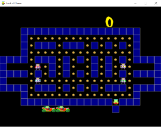

# Projeto Lock and Chase
## FPRO/L.EIC, 2021/22
## Pedro Vidal Marcelino (up202108754)
## 1L.EIC03

### Objetivo

1. Criar um clone do jogo Lock N' Chase em Pygame.

### Repositório de código

1) Link para o repositório do GitHub: https://github.com/Vidal322/lock-and-chase

- https://github.com/rpmcruz

### Descrição

É um jogo de labirinto em que o jogador contola um ladrão, com as setas do teclado, cujo objetivo é apanhar todas as moedas de ouro espalhadas pelo mapa, sem ser apanhado pelos 4 detetives a vaguear pelo mapa.

É possível colocar paredes temporárias, com a tecla espaço, para impedir a passagem das personagens no local por onde o jogador acabou de passar

### UI

### Pacotes

- Pygame

### Tarefas

1. desenhar a matriz do nível
1. ler teclas e mover as peças
2. verificar se jogador chegou ao fim do nível / apanhou todas as moedas
3. Adicionar vidas
4. Adicionar Sprites
5. Adicionar Ecrã de início e fim
6. Highscore
